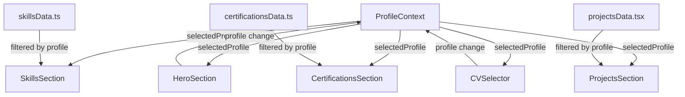

# 🏗️ Architecture du Portfolio - Guide Technique

> **Documentation technique pour comprendre l'architecture et l'organisation du code**

---

## 📋 Vue d'Ensemble

Ce portfolio utilise une **architecture modulaire** basée sur React avec un **système de contexte** pour gérer les différents profils professionnels.

### 🎯 Concept Principal
```
Un Portfolio = 4 Profils Professionnels
├── Data Engineering
├── Cybersécurité & Pentesting  
├── Full Stack Development
└── Project Management PMO
```

---

## 🗂️ Structure Détaillée du Projet

```
portfolio/
├── 📁 public/                          # Fichiers statiques
│   ├── 🖼️ Bilgassim.jpg               # Photo de profil
│   ├── 📄 CV_*.pdf                    # CV pour chaque profil
│   ├── 🖼️ logos/                      # Logos des certifications
│   └── 🤖 robots.txt                  # SEO
│
├── 📁 src/                             # Code source principal
│   ├── 📁 components/                  # Composants réutilisables
│   │   ├── 🏠 HeroSection.tsx          # Section d'accueil
│   │   ├── 🚀 ProjectsSection.tsx      # Section projets
│   │   ├── 💪 SkillsSection.tsx        # Section compétences
│   │   ├── 🏆 CertificationsSection.tsx # Section certifications
│   │   ├── 🎓 EducationSection.tsx     # Section formation
│   │   ├── 👤 AboutSection.tsx         # Section à propos
│   │   ├── 📞 ContactSection.tsx       # Section contact
│   │   ├── 📄 CVSelector.tsx           # Sélecteur de CV
│   │   ├── 🤖 AgentChatWidget.tsx      # Widget chatbot
│   │   ├── ⏳ LoadingPage.tsx          # Page de chargement
│   │   ├── 🧭 Navbar.tsx              # Barre de navigation
│   │   ├── 🦶 Footer.tsx              # Pied de page
│   │   │
│   │   ├── 📁 projects/                # Composants projets
│   │   │   ├── ProjectCardWithTabs.tsx # Carte projet avec onglets
│   │   │   ├── TimelineProjectCard.tsx # Carte projet timeline
│   │   │   ├── SimpleProjectCard.tsx   # Carte projet simple
│   │   │   ├── projectsData.tsx        # Données des projets
│   │   │   └── simpleProjectsData.tsx  # Données projets simples
│   │   │
│   │   └── 📁 ui/                      # Composants UI (Shadcn)
│   │       ├── button.tsx              # Composant bouton
│   │       ├── card.tsx               # Composant carte
│   │       ├── badge.tsx              # Composant badge
│   │       └── ...autres composants UI
│   │
│   ├── 📁 context/                     # Gestion d'état global
│   │   └── 🔄 ProfileContext.tsx       # ⭐ CŒUR DU SYSTÈME ⭐
│   │
│   ├── 📁 data/                        # Données statiques
│   │   ├── 💪 skillsData.ts            # Compétences par profil
│   │   └── 🏆 certificationsData.ts    # Certifications par profil
│   │
│   ├── 📁 pages/                       # Pages principales
│   │   ├── Index.tsx                   # Page d'accueil
│   │   └── NotFound.tsx               # Page 404
│   │
│   ├── 📁 hooks/                       # Hooks personnalisés
│   │   ├── useLoading.ts              # Hook de chargement
│   │   └── use-mobile.tsx             # Hook responsive
│   │
│   ├── 📁 lib/                         # Utilitaires
│   │   └── utils.ts                   # Fonctions utilitaires
│   │
│   ├── 🎨 index.css                   # Styles globaux + variables CSS
│   ├── 🚀 main.tsx                    # Point d'entrée
│   └── 📱 App.tsx                     # Composant racine
│
├── 📁 docs/                            # Documentation
│   ├── GUIDE_MODIFICATION.md          # Guide de modification
│   └── ARCHITECTURE.md               # Ce fichier
│
├── ⚙️ tailwind.config.ts              # Configuration Tailwind
├── ⚙️ vite.config.ts                  # Configuration Vite
├── ⚙️ tsconfig.json                   # Configuration TypeScript
└── 📄 package.json                    # Dépendances du projet
```

---

## 🔄 Système de Profils (Architecture Principale)

### 🧠 ProfileContext - Le Cerveau du Portfolio

**📁 Fichier:** `src/context/ProfileContext.tsx`

```typescript
// 🎯 Types de profils disponibles
export type ProfileType = 'data-engineering' | 'pentesting' | 'fullstack' | 'project-manager';

// 🏷️ Interface du contexte
interface ProfileContextType {
  selectedProfile: ProfileType;           // Profil actuellement sélectionné
  setSelectedProfile: (profile: ProfileType) => void;  // Fonction pour changer de profil
  getProfileTitle: (profile: ProfileType) => string;   // Obtenir le titre d'un profil
  getProfileDescription: (profile: ProfileType) => string; // Obtenir la description
}
```

### 🔗 Comment les Composants Utilisent le Contexte

```typescript
// Dans n'importe quel composant :
import { useProfile } from '@/context/ProfileContext';

const MonComposant = () => {
  const { selectedProfile, setSelectedProfile } = useProfile();
  
  // Le contenu s'adapte automatiquement selon selectedProfile
  return (
    <div>
      {/* Contenu qui change selon le profil */}
    </div>
  );
};
```

---

## 🎨 Système de Design

### 🌈 Variables CSS (Design Tokens)

**📁 Fichier:** `src/index.css`

```css
:root {
  /* 🎨 Couleurs principales */
  --primary: 220 100% 50%;              /* Bleu principal */
  --primary-foreground: 210 40% 98%;    /* Texte sur primary */
  
  /* 🌫️ Couleurs de fond */
  --background: 0 0% 100%;              /* Fond principal (blanc) */
  --foreground: 222.2 84% 4.9%;         /* Texte principal (sombre) */
  
  /* 📦 Couleurs des cartes */
  --card: 0 0% 100%;                    /* Fond des cartes */
  --card-foreground: 222.2 84% 4.9%;    /* Texte des cartes */
  
  /* 🔘 Couleurs des boutons secondaires */
  --secondary: 210 40% 96%;             /* Fond bouton secondaire */
  --secondary-foreground: 222.2 84% 4.9%; /* Texte bouton secondaire */
}
```

### 🎯 Système de Classes Utilitaires

```css
/* 🎭 Classes personnalisées pour le portfolio */
.portfolio-gradient {
  background: linear-gradient(135deg, var(--primary), var(--secondary));
}

.portfolio-card {
  @apply bg-card border border-border rounded-lg shadow-sm hover:shadow-md transition-shadow;
}

.portfolio-button {
  @apply bg-primary text-primary-foreground hover:bg-primary/90 transition-colors;
}
```

---

## 📊 Flux de Données

### 🔄 Comment les Données Circulent



### 📋 Exemple de Filtrage des Données

```typescript
// Dans SkillsSection.tsx
const { selectedProfile } = useProfile();

// Filtrage automatique des compétences
const filteredSkills = skills.filter(skill => 
  skill.profiles.includes(selectedProfile)
);

// Rendu conditionnel basé sur le profil
return (
  <div>
    {filteredSkills.map(skill => (
      <SkillCard key={skill.name} skill={skill} />
    ))}
  </div>
);
```

---

## 🧩 Composants Principaux

### 🏠 HeroSection
**Rôle :** Section d'accueil avec photo, nom, et description dynamique
```typescript
// Caractéristiques :
- Photo de profil avec effets de survol
- Nom et description qui changent selon le profil
- Liens vers réseaux sociaux
- Intégration du CVSelector
- Animations d'entrée fluides
```

### 🚀 ProjectsSection
**Rôle :** Affichage des projets filtrés par profil
```typescript
// Caractéristiques :
- Filtrage automatique par profil
- Trois types de cartes (tabs, timeline, simple)
- Catégorisation des projets
- Liens vers GitHub et démos
```

### 💪 SkillsSection
**Rôle :** Compétences techniques et langues
```typescript
// Caractéristiques :
- Filtrage par profil et catégorie
- Barres de progression animées
- Regroupement par catégories
- Section langues avec drapeaux
```

### 🏆 CertificationsSection
**Rôle :** Certifications avec hovers informatifs
```typescript
// Caractéristiques :
- Filtrage par profil
- HoverCards avec détails
- Logos des organismes
- Dates et descriptions
```

---

## ⚡ Performance & Optimisation

### 🚀 Optimisations Implémentées

1. **Lazy Loading :** Images chargées à la demande
2. **Code Splitting :** Composants chargés séparément
3. **Memoization :** Calculs mis en cache avec useMemo
4. **Optimistic Updates :** Changements instantanés d'interface

### 📱 Responsive Design

```typescript
// Breakpoints Tailwind utilisés :
- sm: 640px   // Smartphones en paysage
- md: 768px   // Tablettes
- lg: 1024px  // Ordinateurs portables
- xl: 1280px  // Écrans larges
- 2xl: 1536px // Très grands écrans
```

---

## 🔧 Technologies & Outils

### 📚 Stack Technique

| Technologie | Version | Rôle |
|-------------|---------|------|
| **React** | 18.x | Framework UI |
| **TypeScript** | 5.x | Typage statique |
| **Vite** | 5.x | Build tool |
| **Tailwind CSS** | 3.x | Styles utilitaires |
| **Framer Motion** | 12.x | Animations |
| **Radix UI** | Latest | Composants accessibles |
| **Lucide React** | Latest | Icônes |

### 🛠️ Outils de Développement

```json
{
  "scripts": {
    "dev": "vite",                    // Serveur de développement
    "build": "tsc && vite build",     // Build de production
    "preview": "vite preview",        // Prévisualisation
    "lint": "eslint src --ext ts,tsx" // Vérification du code
  }
}
```

---

## 🔐 Bonnes Pratiques Implémentées

### ✅ Code Quality

1. **TypeScript :** Typage strict pour éviter les erreurs
2. **ESLint :** Règles de code consistantes
3. **Composants Purs :** Fonctions sans effets de bord
4. **Naming Convention :** Noms explicites et cohérents

### ✅ Performance

1. **Bundle Splitting :** Code divisé par routes
2. **Tree Shaking :** Code mort éliminé automatiquement
3. **Image Optimization :** Formats et tailles optimisés
4. **CSS Purging :** Styles inutilisés supprimés

### ✅ Accessibilité

1. **Semantic HTML :** Balises significatives
2. **ARIA Labels :** Étiquettes pour lecteurs d'écran
3. **Keyboard Navigation :** Navigation au clavier
4. **Color Contrast :** Contrastes respectés

### ✅ SEO

1. **Meta Tags :** Balises de métadonnées
2. **Structured Data :** Données structurées JSON-LD
3. **Sitemap :** Plan du site généré
4. **Robots.txt :** Instructions pour robots

---

## 🚀 Déploiement

### 📦 Build de Production

```bash
# 1. Installation des dépendances
npm install

# 2. Build optimisé
npm run build

# 3. Dossier de sortie
dist/  # Contient les fichiers optimisés pour la production
```

### 🌐 Plateformes de Déploiement

- **Netlify** ✅ (Recommandé)
- **Vercel** ✅
- **GitHub Pages** ✅
- **Firebase Hosting** ✅

---

## 🔮 Évolutions Futures

### 🎯 Améliorations Prévues

1. **CMS Headless :** Gestion de contenu dynamique
2. **Animations Avancées :** GSAP pour des animations complexes
3. **PWA :** Application web progressive
4. **Testing :** Tests unitaires et e2e
5. **Analytics :** Suivi des performances
6. **i18n :** Internationalisation multi-langues

### 🏗️ Refactoring Potentiel

1. **State Management :** Migration vers Zustand ou Redux Toolkit
2. **Routing :** Ajout de pages supplémentaires
3. **Database :** Intégration d'une base de données
4. **API :** Endpoints pour contenu dynamique

---

**💡 Cette architecture modulaire permet une maintenance facile et des évolutions fluides du portfolio.**

*Documentation maintenue par Mohamed Boulkassoum - Mise à jour : 2024*